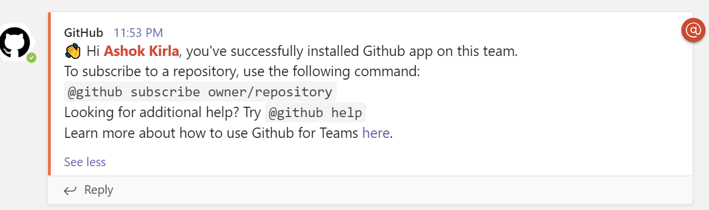

# GitHub + Microsoft Teams Integration (Public Preview)

## Help Your Teams Communicate and Collaborate Better

GitHub is the world's leading software development platform. [Microsoft Teams](https://products.office.com/microsoft-teams/group-chat-software) is one of the more popular communication platforms where modern development teams come together to build world-class products and services. With two of your most important workspaces connected, you'll stay updated on what's happening on GitHub without leaving Microsoft Teams. 

Developers spend a considerable amount of time communicating with the team, monitoring the issues, pull requests and deployment statuses. This necessitates constant switching of context between GitHub and Microsoft Teams (collaborate). The GitHub integration for Microsoft Teams gives you and your teams full visibility into your GitHub projects right in your Teams channels, where you generate ideas, triage issues and collaborate with other teams to move projects forward. 

This integration is built and maintained by GitHub.

## Table of Contents
- [Installing the GitHub integration for Teams](#installing-the-github-integration-for-teams)
  - [Requirements](#requirements)
  - [Installation](#installation)
 - [Get Started](#get-started) 
   - [Subscribe notifications](#subscribe-notifications)
   - [Customize notifications](#customize-notifications)
   - [Filters](#filters)
   - [PR and Issue notification cards and Threading](#pr-and-issue-notification-cards-and-threading)
   - [Move conversations into next steps](#move-conversations-into-next-steps)
   - [Unfurling GitHub links](#unfurling-github-links)
   - [Personal app experience](#personal-app-experience)
   - [Command Reference](#command-reference)
   - [Authorization](#authorization)
- [Future work](#future-work)
- [Feedback](#feedback)
--------
## Installing the GitHub integration for Teams
### Requirements
This app officially supports GitHub.com (which includes our GitHub Enterprise cloud-hosted offering) and Teams.microsoft.com.

### Installation
You can go to Microsoft teams app store and install GitHub (Preview) app or you can directly install from [here](https://teams.microsoft.com/l/app/ca9e26b7-dce5-44a0-b2b7-a70a3d65ce25). 

Upon installing, a welcome message is displayed as shown in the following image. Use the ``@GitHub`` handle to start interacting with the app.

 
## Get Started 
At this point, your Teams and GitHub user accounts are not linked. To link the two accounts, authenticate to GitHub using a @github signin command.

### Subscribe notifications
You can subscribe to get notifications for pull requests and issues for an Organization or Repository's activity using `@github subscribe <organization>/<repository>` command. 

Before you subscribe, a Microsoft Teams app needs to be installed in GitHub and you need to grant access to the repositories you would like to subscribe. 

If you originally gave the app access to "All repositories" and you've created a new private repository on GitHub after installing the GitHub integration for Teams, the `@github subscribe` command will work automatically on your new repository. If you installed the app on a subset of repositories, the app will prompt you to install it on the new repository. 

You need to be an organization / account owner to install the app. If you dont have access, you can request your account owner to configure the Microsoft Teams app to grant access to the repositories you need work on. You can find this app in your organization settings -> applications -> installed apps. This is a one time activity and after that you can subscribe to repository / organization in the channel of your choice.

The `@github` command also supports `unsubscribe`. To unsubscribe to notifications from a repository, use `@github unsubscribe <organization>/<repository>`

### Customize notifications
You can customize your notifications by subscribing to activity that is relevant to your Teams channel, and unsubscribing from activity that is less helpful to your project.

You can configure them using following commands:
`@github subscribe owner/repo [feature]`
`@github unsubscribe owner/repo [feature]`

Below features are enabled by default, and can be disabled with the `@github unsubscribe owner/repo [feature]` command:
- issues - Opened / closed / ReOpened 
- pulls - New / merged / Close / ReOpen 
- commits - New commits on the default branch (usually master)
- comments - New comments on issues and pull requests

These are disabled by default, and can be enabled with the '@github subscribe owner/repo [feature]' command:
- reviews - Pull request reviews
- +label:"your label" - Filter issues, pull-requests and comments based on their labels.

To see the list of subscribed features, use `@github subscribe list features`

### Filters
Label filters allow filtering incoming events based on a whitelisted label. You can add a lable filter with subscribe command
`@github subscribe owner/repo +label:priority:HIGH`

This creates a required-label filter with the value priority:HIGH. Incoming events that support filters discarded unless they have that label. To update the existing filter just enter a new one, the old one will be updated. Currently, we only support having one filter. Multiple filters might be supported in the future.

The notifications that are filtered by label are:
- issues
- pull requests
- reviews
- comments (for both issues and pull requests)

You can remove a filter by with unsubscribe command
'@github unsubscribe owner/repo +label:priority:HIGH'

It is common to have certain special characters in labels. Therefore we added support for the most common special characters for label filters. Here a few examples:
- label:priority:HIGH
- label:teams/designers
- label:"DO NOT MERGE"
- label:"very important"
- label:":construction: WIP"

### PR and Issue notification cards and Threading
Notifications for any PR and Issue are grouped under a parent card as replies. The parent card always shows the latest status of the PR/Issue along with other meta-data like title, description, assignees, reviewers, labels and checks. Threading gives context and helps improve collaboration in the channel.

Any new event that happens on a pull request or issue (like comment/review/close/merge) is added as a reply to the parent card. 

Note: In case of Draft PRs, updates are not notified in the channel. Once the Draft PR is moved to ready, the channel will start getting the notifications

### Move conversations into next steps
Teams conversations often lead to decisions and actionable takeaways. You can perform following actions on GitHub directly from Microsoft Teams:
- Create issue
- Close and ReOpen issue
- Comment on issue and pull request

Users need to be signed into GitHub to perform these actions from Teams. In case the user did not sign in and tried to perform this action, the user gets a notification to sign in before performing the action.

### Unfurling GitHub links
When you share links to GitHub activities and properties in the channel, more details are automatically extracted and shown as preview in Microsoft Teams channel. We support link previews for:
- pull requests
- issues
- comments
- code snippets
- repositories
- accounts or organizations

Previews of links will not be shown if the repository is private and the user that shared the link:
- Not signed in to their GitHub account
- The repository is not authorized i.e the Microsoft Teams app is not installed in the GitHub repo.

### Personal app experience
As part of personal app experience, you can `signin` and `signout` from GitHub. You can signin to GitHub with Personal app chat and avoid separate signin in your channels.
We will add other capabilities like subscribe and actions in future.

### Command reference

The following table lists all the commands you can use in your Microsoft Teams channel.

|Command	| Functionality |
| -------------------- |----------------|
| @github signin	| Connect to your GitHub Account |
| @github subscribe <organization>/<Repository>	| Subscribe to and Organization or Repository |
| @github subscribe <organization>/<Repository>	[feature] | Subscribe to specific feature in an Organization or Repository |
| @github subscribe list	| List the subscriptions in the channel |
| @github subscribe list	features | List the subscriptions in the channel and the features subscribed |
| @github unsubscribe <Organization>/<Repository>	| Unsubscribe from Organization or Repository |
| @github unsubscribe <Organization>/<Repository>	[feature] | Unsubscribe a specific feature in an Organization or Repository |
| @github signout	| Disconnect with your GitHub Account and remove all subscriptions |

### Authorization
By granting the app access, you are providing the following authorizations to your GitHub and Microsoft Teams accounts:

#### Teams permission scopes

|Permission scope|Why we need it|
|---|---|
|Access private conversations between you and the App | To message you with instructions.  |
|Add link previews to GitHub.com to messages| To render rich links to `github.com`|
|Add github commands| To add the `@github` command to your Team channels |
|View the organization's name, email domain, and icon| To store subscriptions you set up|
|Post messages as the app| To notify you of activity that happens on GitHub|

#### GitHub permission scopes

|Permission scope|Why we need it|
|---|---|
|Read access to issues, metadata, pull requests, and repository projects | To render previews of links shared in Teams|

## Future work
We're constantly at work to improve the app, and soon you’ll see new features stated below. To request additional capabilities please [request a feature](https://github.com/integrations/microsoft-teams/issues/new).

Some ideas under consideration:

* Schedule reminders
* Personal app support for subscribe
* GitHub Actions support
* Support for GHES

## Feedback

Please [create an issue](https://github.com/integrations/microsoft-teams/issues/new) to request a feature or report a problem.
