# GitHub + Microsoft Teams Integration

## Help Your Teams Communicate and Collaborate Better

GitHub is the world's leading software development platform. [Microsoft Teams](https://products.office.com/microsoft-teams/group-chat-software) is one of the most popular communication platforms where modern development teams come together to build world-class products and services. With two of your most important workspaces connected, you'll stay updated on what's happening on GitHub without leaving Microsoft Teams.

Developers spend a considerable amount of time communicating with the team, monitoring the issues, pull requests and deployment statuses. This necessitates constant switching of context between GitHub and Microsoft Teams (collaborate). The GitHub integration for Microsoft Teams gives you and your teams full visibility into your GitHub projects right in your Teams channels, where you generate ideas, triage issues and collaborate with other teams to move projects forward.

GitHub integration for Microsoft Teams is now GA and is built and maintained by GitHub.

## Table of Contents
- [Installing the GitHub integration for Teams](#installing-the-github-integration-for-teams)
  - [Requirements](#requirements)
  - [Installation](#installation)
 - [Get Started](#get-started)
   - [Subscribe notifications](#subscribe-notifications)
   - [Customize notifications](#customize-notifications)
   - [Filters](#filters)
   - [PR and Issue notification cards and Threading](#pr-and-issue-notification-cards-and-threading)
   - [Move conversations into next steps](#move-conversations-into-next-steps)
   - [Actions workflow notifications](#actions-workflow-notifications)
   - [Deployment notifications](#deployment-notifications)
   - [Mentions](#mentions)
   - [Unfurling GitHub links](#unfurling-github-links)
   - [Personal app experience](#personal-app-experience)
   - [Schedule Reminders](#schedule-reminders)
   - [Command Reference](#command-reference)
   - [Authorization](#authorization)
- [GHEC Integration](#ghec-integration)
- [GHES Integration](#ghes-integration)
- [Future work](#future-work)
- [Feedback](#feedback)
--------
## Installing the GitHub integration for Teams
### Installation
You can go to Microsoft teams app store and install GitHub app or you can directly install from [here](https://teams.microsoft.com/l/app/ca9e26b7-dce5-44a0-b2b7-a70a3d65ce25).

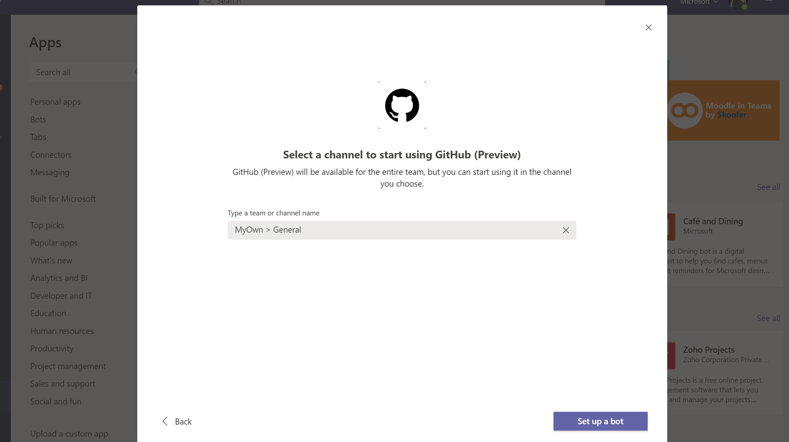

Upon installing, a welcome message is displayed as shown in the following image. Use the ``@GitHub`` handle to start interacting with the app.

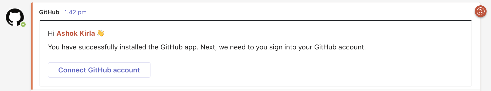

## Get Started
At this point, your Teams and GitHub user accounts are not linked. To link the two accounts, authenticate to GitHub using a @github signin command.

### Subscribe notifications
You can subscribe to get notifications for pull requests and issues for an Organization or Repository's activity using `@github subscribe <organization>/<repository>` command.

Before you subscribe, a Microsoft Teams app needs to be installed in GitHub and you need to grant access to the repositories you would like to subscribe.

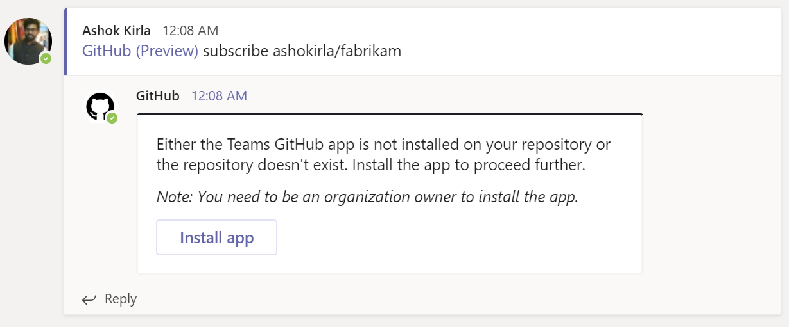

If you originally gave the app access to "All repositories" and you've created a new private repository on GitHub after installing the GitHub integration for Teams, the `@github subscribe` command will work automatically on your new repository. If you installed the app on a subset of repositories, the app will prompt you to install it on the new repository.

You need to be an organization / account owner to install the app. If you dont have access, you can request your account owner to configure the Microsoft Teams app to grant access to the repositories you need work on. You can find this app in your organization settings -> applications -> installed apps. This is a one time activity and after that you can subscribe to repository / organization in the channel of your choice.

The `@github` command also supports `unsubscribe`. To unsubscribe to notifications from a repository, use `@github unsubscribe <organization>/<repository>`

### Customize notifications
You can customize your notifications by subscribing to activity that is relevant to your Teams channel, and unsubscribing from activity that is less helpful to your project.

You can configure them using following commands:
`@github subscribe owner/repo [feature]`
`@github unsubscribe owner/repo [feature]`

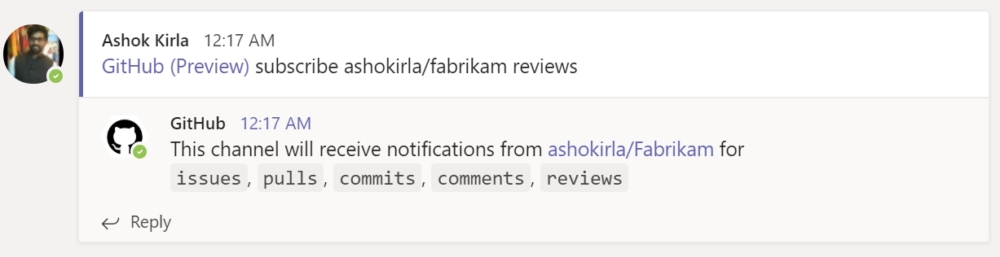

Below features are enabled by default, and can be disabled with the `@github unsubscribe owner/repo [feature]` command:
- issues - Opened / closed / ReOpened
- pulls - New / merged / Close / ReOpen
- commits - New commits on the default branch (usually main)
- comments - New comments on issues and pull requests
- deployments - Deployment status notifications
- releases - New release and pre-release published

These are disabled by default, and can be enabled with the '@github subscribe owner/repo [feature]' command:
- reviews - Pull request reviews
- workflows - Actions workflows and approval notifications
- branches - branch creation and deletion
- discussions - Discussions created or answered
- +label:"your label" - Filter issues, pull-requests and comments based on their labels.

We also support repository notifications. You will get notified when your repo is made public or deleted. This notification is enabled by default and there is no separate feature to turn in off. Since repository update is a destructive activity, we want to notify the customer always.

To see the list of subscribed features, use `@github subscribe list features`

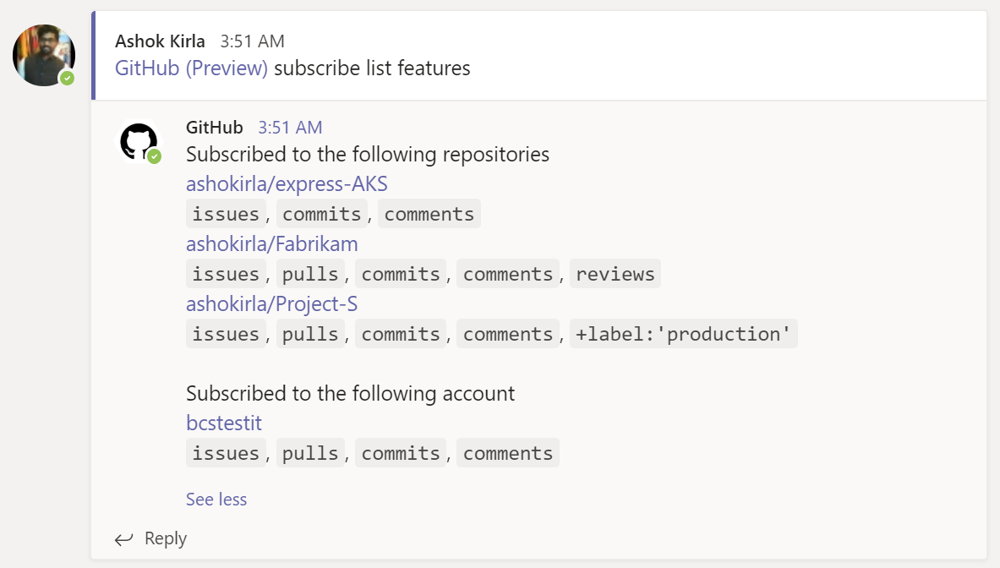

### Filters
#### Branch filters for commits
Branch filters allow filtering commit notifications. By default when you subscribe for commits feature, you will get notifications for your default branch (i.e. main). However, you can choose to filter on a specific branch, or a pattern of branches or all branches.

- `@github subscribe org/repo commits`  for commit notifications from a default branch.
- `@github subscribe org/repo commits:*`  for commit notifications across all the branches.
- `@github subscribe org/repo commits:myBranch`  for commit notifications from a specific branch.
- `@github subscribe org/repo commits:users/*`  for commit notifications from a pattern of branches.

You can unsubscribe from the commits feature using `@github unsubscribe org/repo commits.

#### Label filters for issues and prs
Label filters allow filtering incoming events based on a whitelisted label. You can add a label filter with the subscribe command
`@github subscribe owner/repo +label:priority:HIGH`

This creates a required-label filter with the value priority:HIGH. Incoming events that support filters are discarded unless they have that label. To update the existing filter just enter a new one, the old one will be updated. Currently, we only support having one filter. Multiple filters might be supported in the future.

The notifications that are filtered by label are:
- issues
- pull requests
- reviews
- comments (for both issues and pull requests)

You can remove a filter by with unsubscribe command
'@github unsubscribe owner/repo +label:priority:HIGH'

It is common to have certain special characters in labels. Therefore we added support for the most common special characters for label filters. Here are a few examples:
- label:priority:HIGH
- label:teams/designers
- label:"DO NOT MERGE"
- label:"very important"
- label:":construction: WIP"

### PR and Issue notification cards and Threading
Notifications for any PR and Issue are grouped under a parent card as replies. The parent card always shows the latest status of the PR/Issue along with other meta-data like title, description, assignees, reviewers, labels and checks. Threading gives context and helps improve collaboration in the channel.

Any new event that happens on a pull request or issue (like comment/review/close/merge) is added as a reply to the parent card.

Note: In case of Draft PRs, updates are not notified. Once the Draft PR is moved to ready, you will start getting the notifications

### Move conversations into next steps
Teams conversations often lead to decisions and actionable takeaways. You can perform following actions on GitHub directly from Microsoft Teams:

#### Issue creation experience
You can now create issue by just a click, right from the place where you collaborate. In any channel/personal app, you can now click on the three dots (...) at the top right corner of a message and choose 'Create an Issue' from the 'More actions' list. This will launch a create issue dialogue.

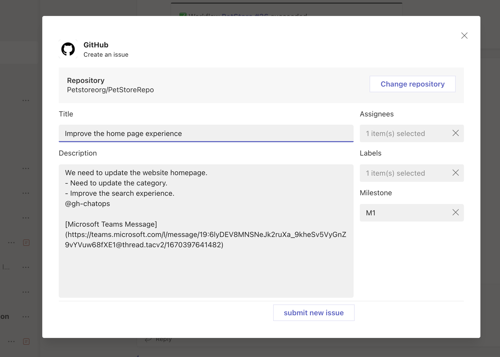

- The content of the message from which you have triggered this create issue flow will be filled into the description helping you get started on the issue. Also the link of the MS Teams conversation will be added to description in the end automatically giving you reference when you want to track the issue later. You can also edit the entire description if you want.
- The last used repo in the channel will be automatically filled in. However, you can go ahead and change to the repo of your choice.
- You can optionally fill in labels, assignees and milestones when you create an issue.
Once the issue is created you will receive a confirmation card in the channel from where you have initiated the issue creation flow.

Alternatively, you can create an issue from the commands by invoking @GitHub from the chat in your channel or personal app.

Note: You need to be signed in and have necessary access to the repo to create an issue.

#### Manage your issues and prs
You can also peform other actions on your Issues and PR like
- Close and ReOpen issue
- Comment on issue and pull request

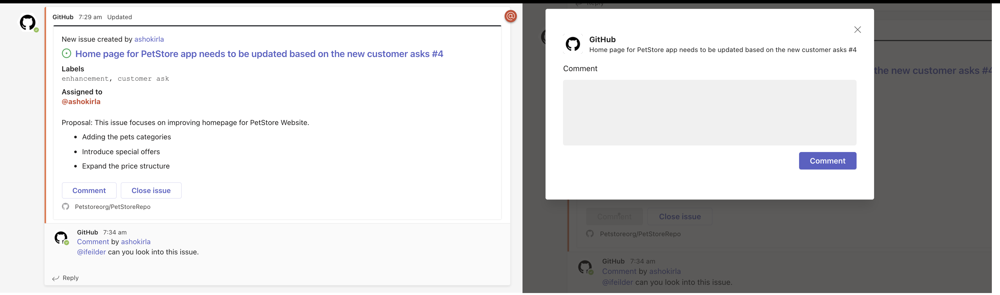

Users need to be signed into GitHub to perform these actions from Teams. In case the user did not sign in and tried to perform this action, the user gets a notification to sign in before performing the action.

### Actions workflow notifications
You can subscribe to GitHub Actions workflow run notifications from your channel or personal app using "workflows" feature.

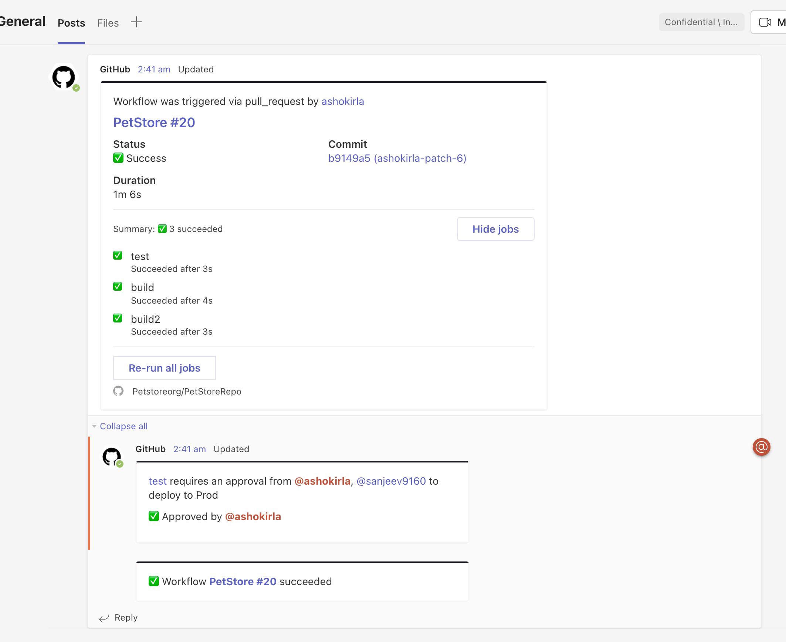

- You will get notified when a new workflow run is triggered and you can track the live status of the jobs. 
- You can track the approval notifications as a reply in the thread and you can approve the notifications directly from the channel/personal app.
- Once the workflow is completed, you will get a update as a reply in the thread so that you can see the complete context and history of the workflow run.
- If something fails, you can choose to rerun the workflow in place and you can also enable debug logs if needed.

#### Workflow notification filters
Getting notified about each and every workflow run notification can be noisy. So, we are providing you capability to filter the notifications based on your requirement.
You can filter your actions workflows notifications based on name, event, actor and/or branch. You can filter the notifications as below.

`@github subscribe owner/repo workflows:{name:"your workflow name" event:"workflow event" branch:"branch name" actor:"actor name"}`

- **name**: Name of your workflow
- **event**: The event on which the workflow is triggered. You can find all the available events list [here](https://docs.github.com/en/actions/using-workflows/events-that-trigger-workflows#available-events).
- **actor**: The person who triggered or responsible for running of the workflow
- **branch**: The branch on which the workflow is running. Only incase where pull_request event is included, the branch will be the target branch the pull request is created for.

You can pass multiple entries for each of the events in as a comma separate list as below example:
`@github subscribe org/repo workflows:{event:"pull_request","push" branch:"main","dev" actor:"ashokirla"}`

By default, when you configure workflow notifications without passing any filters, it is configured for workflows triggered via pull requests targeting your default branch.
You can pass one or multiple entries. 

You can unsubscribe for workflows notifications by just running the below command:
`@github unsubscribe org/repo workflows`

#### Updates to the app permissions
To subscribe and receive the notifications for actions workflow run updates you need to grant access to Actions events in your organization for GitHub app in MS Teams. You may be prompted to do so as you try to enable `workflows` feature for your organization the first time.

### Deployment notifications
We support a separate notifications for your deployments. These deployments can happen from Actions or from external sources using [Deployments api](https://docs.github.com/en/rest/deployments/deployments?apiVersion=2022-11-28#about-the-deployments-api). 

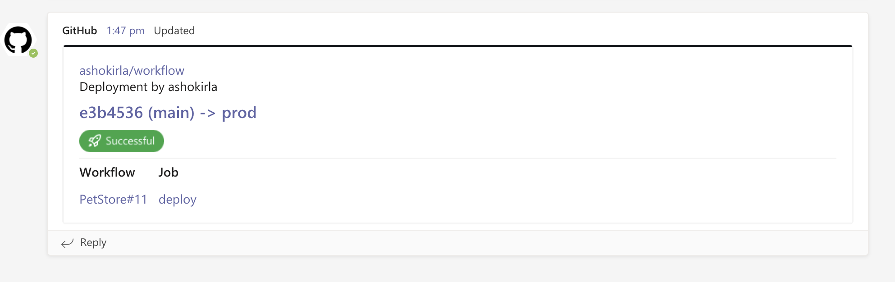

You can enable/disable this feature by running:

`@github subscribe/unsubscribe org/repo deployments`

Note: If you are using GitHub actions and want to track your deployments to environments, we recommend to use the new `workflows` feature instead as it shows the full picture and gives you ability to approve your deployments inplace. 

### Mentions
When you subscribe to a repository in Teams, you will now see yourself mentioned in the notifications where you are referred and needs your attention.

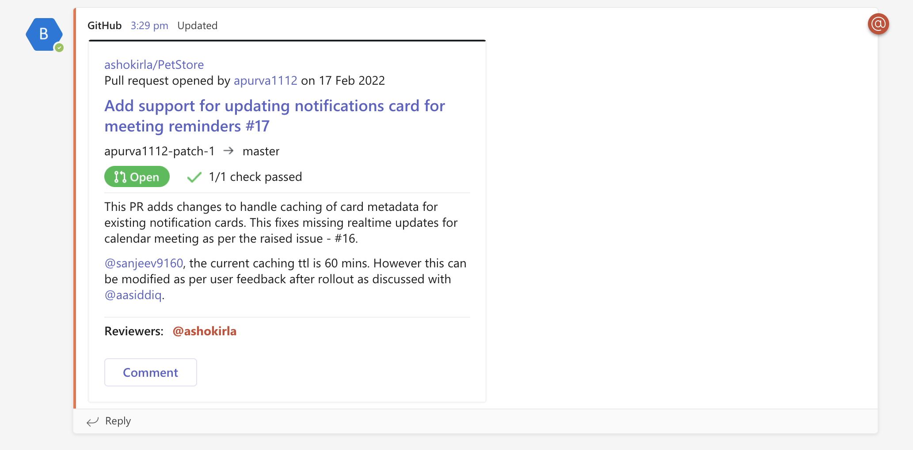

When you receive notifications for Issues, PRs and Deployments, here are the cases when you will be mentioned.
- Assignee in an Issue
- Reviewer for a PR
- Mentioned in a PR/Issue description/comment/discussion
- Reviewer for a Deployment
- Scheduled reminders for PR review requests

#### How does mentions work?
Mentions will work only if you login to GitHub app from Microsoft Teams. When you login to GitHub app with your GitHub id, we map it with your Microsoft Teams id and ping you in Teams whenever you are mentioned in any of the GitHub notifications.  

**Note**: If you have multiple Microsoft Teams tenants where you use GitHub app, mentions will work only in the tenant where you login to GitHub app the latest. 

### Unfurling GitHub links
When you share links to GitHub activities and properties in the channel, more details are automatically extracted and shown as preview in Microsoft Teams channel. We support link previews for:
- pull requests
- issues
- discussions
- comments
- code snippets
- repositories
- accounts or organizations

Previews of links will not be shown if the repository is private and the user that shared the link:
- Not signed in to their GitHub account
- The repository is not authorized i.e the Microsoft Teams app is not installed in the GitHub repo.

#### Unfurling discussions

Discussions and discussion comments can be automatically unfurled in Teams.

Unfurling links to discussions requires the `Discussions (read)` permission to be granted to the installed GitHub Teams app in your organization or repository.

If you have previously installed the GitHub Teams app and you aren't able to unfurl discussion links, you may need to update your app to have the latest permissions.

You can update your installation's permissions by following these steps:
1. Go to your organization settings tab.
2. Click "GitHub Apps" on the sidebar.
3. You should see an entry for "Microsoft Teams for GitHub", with a message saying that a permissions update has been requested. Click the "Review request" link.
4. Review the list of updated permissions, which should include "Read access to Discussions".
5. Click the "Accept new permissions" button.

🎉 Now that you've updated the permissions, you can unfrul discussion links!

Note: We're working on making this process easier in the future with a prompt from the Teams integration itself – stay tuned!

### Personal app experience
With our GitHub app, you also get a personal app in MS Teams where you can subscribe to your repos and track your work. The notifications will be posted in the GitHub personal chat that is visible only for you. All the commands and notifications available in your channel are also available in Personal chat for GitHub.

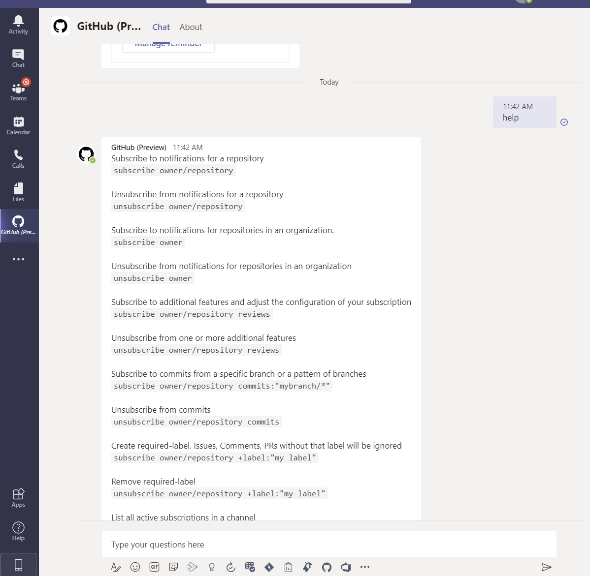

In the personal app, threading is not supported by MS Teams. You get the same notifications in personal chat but they are not grouped under parent cards. Instead, you get independent notifications.

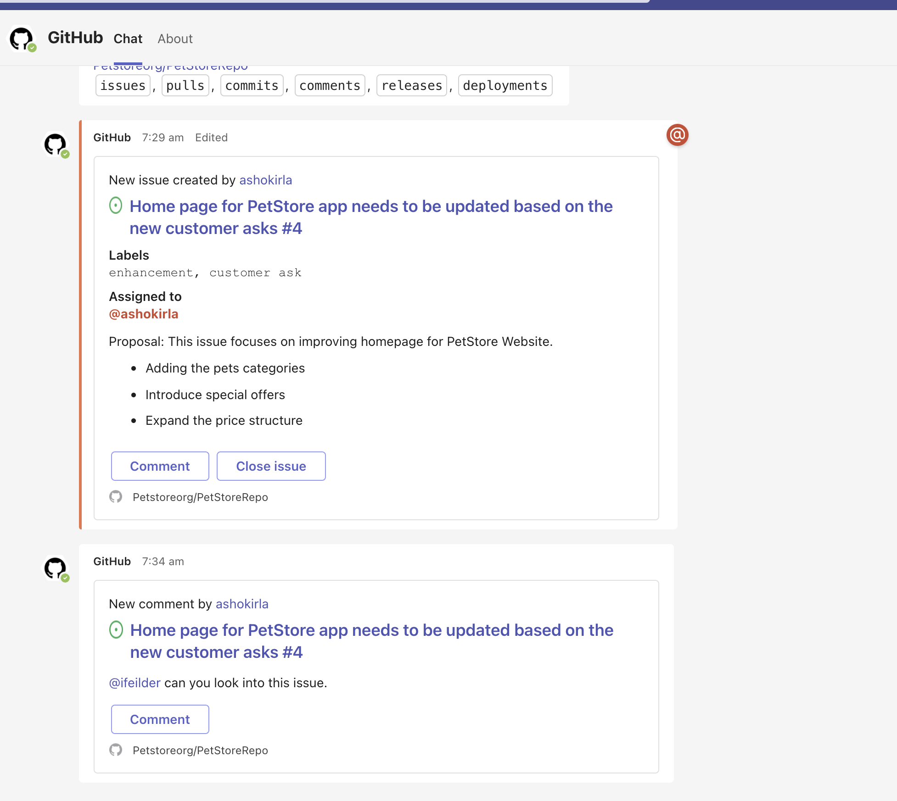

### Schedule Reminders
You can configure schedule reminders for pending pull requests. With this feature you get periodic reminders of pending pull requests as part of your channel or personal chat.

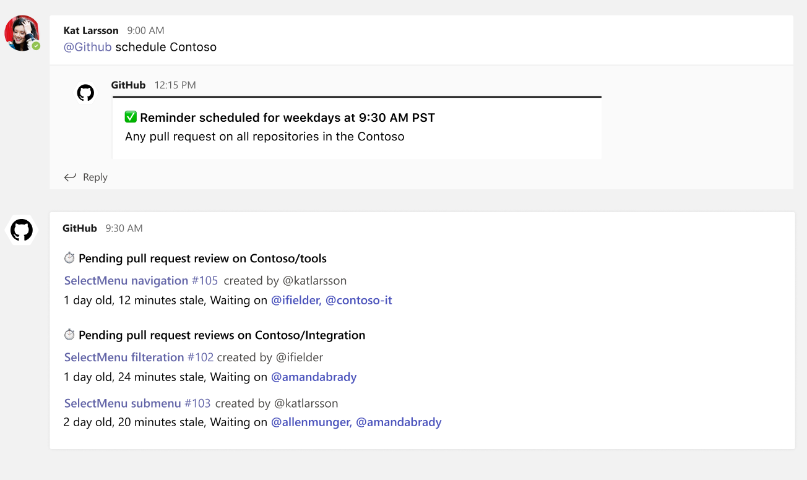

#### What's new with Schedule reminders?
We made significant improvements to schedule reminders experience. 
- The old way of configuring reminders via commands is now gone.
- We have introduced a first class UI to configure your pending pull request reminders. And as part of this UI, we added a bunch of advanced controls that will help you in fine tuning your reminders. 
- We relaxed the administrator requirement to configure reminders. Now, any contributor can schedule reminders in MS Teams for the repositories he/she has access.

#### Channel reminders
Here are the steps to configure reminders for your pending pull requests.

1. From Teams' channel, the user needs to run can run following command to configure a reminder for pending pull requests on your Organization.
`@github schedule organization`

Note: Schedule reminders feature is available only for organizations (not for user accounts). And for free organizations, you can only configure reminders for public repositores. However, if you have a paid plan, you can also configure reminders for private repositories in your organization.

2. This will show all the reminders configured for this organization in this channel and also gives you an option to create a new reminder. If you are just getting started, you can see that no reminders are created for this channed. And you can get started by clicking on 'Create new reminder'.

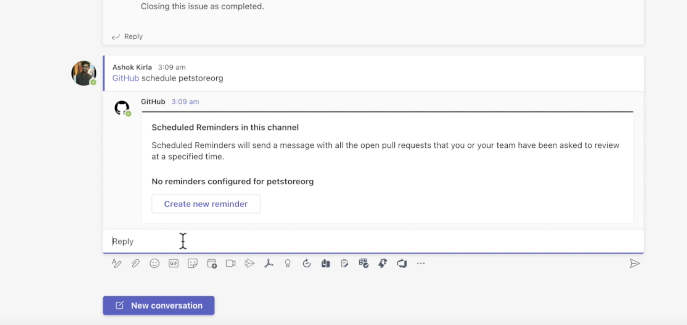

Note: You need to be part of the organization and have write access to atleast one repository to configure reminders for this organization. 

3. This will launch a new popup where you will see bunch of settings to configure your reminders. 

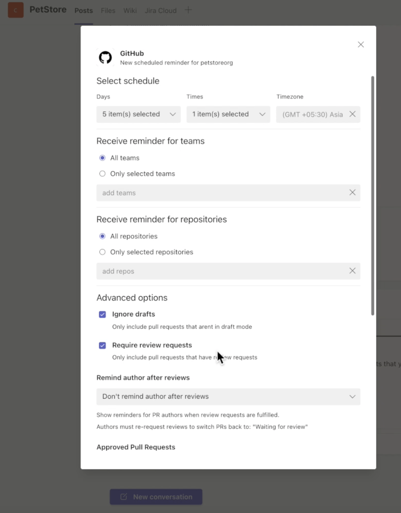

- Days: Choose what days of the week would you like to get the reminders
- Times: Choose what times of day would you like to get reminders
- Timezone: You can choose the timezone 
- Teams filter: Filter the reminders by the teams on which the pull request are pending
- Repositories: Choose for which repos you want to get reminders 

Then you have bunch of advanced options like:
- Ignore drafts
- Require review requests: Would you want to get reminders for all the prs or only for ones that need review
- Remind authors after reviews: Do you want to get reminders after multipler reviews
- Approved pull requests: Do you want to get reminders for approved pull requests as well
- Minimum age and Minimum staleness of the PRs
- Ignore terms in the title
- Ignore labels
- Required labels

All of the above settings will ensure you get reminders for the pull request that need your attention and there is no unnecessary noise in the channel.

4. You can edit or remove reminders for a specific organization by running the following command
`@github schedule organization`

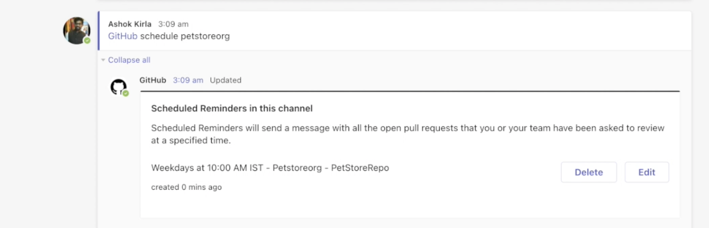

This will list all the reminders configured for the organization in this channel. You can choose to edit or delete them.

5. You can get the list of reminders configured in a channel by running
`@github schedule list`

#### Personal reminders
You can configure similar reminders in your personal chat too. However, unlike channel, the personal app only shows the reminders for the pull requests pending on you or your team.

1. From the personal app, you need to run can run following command to configure a reminder for pending pull requests on your Organization.
`schedule organization`

2. This will show all the reminders configured for this organization in your personal app and also gives you an option to create a new reminder. If you are just getting started, you can see that no reminders are created for this channed. And you can get started by clicking on 'Create new reminder'.

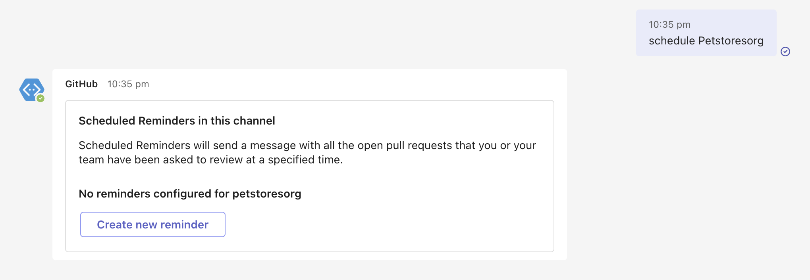

3. This will launch a new popup where you will see bunch of settings to configure your reminders. 

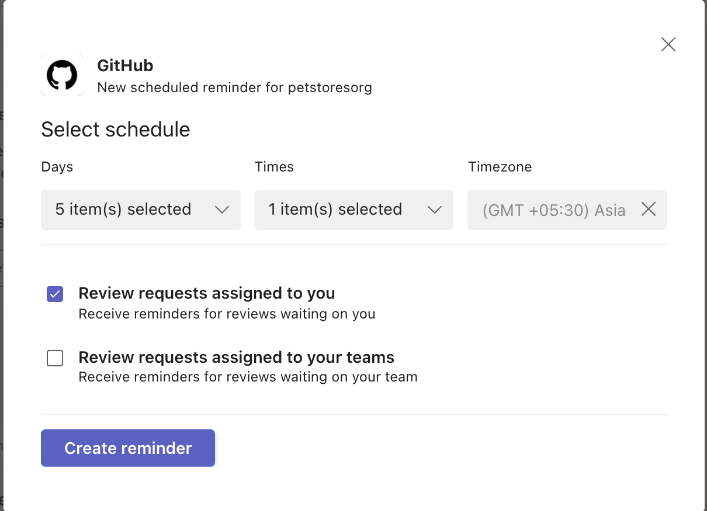

- Days: Choose what days of the week would you like to get the reminders
- Times: Choose what times of day would you like to get reminders
- Reminders pending on your team
- Reminders pending on you

4. You can edit or remove reminders for a specific organization by running the following command
`schedule organization`

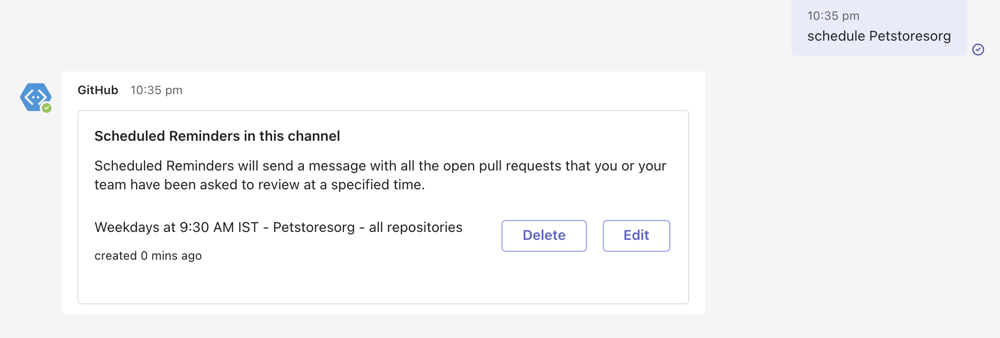

This will list all the reminders configured for the organization in this channel. You can choose to edit or delete them.

5. You can get the list of reminders configured in a channel by running
`schedule list`

**Note** : Please note that there is a minor bug on MSTeams adaptive card platform that effects the edit flow for the schedule reminders. 
In your channel, if you had selected specific repos or teams to filter your reminders when you create,  and later if you try to reopen and edit the reminder, the previous selection of repos or team is not shown in the UI. So, if you are making any changes to the reminder, we suggest you to re-enter the teams/repos again. Incase if your reminder targets 'All repos' and/or 'All teams' in your org, then you will not face this bug. We apologise for this inconvinience. We are following up with MS Teams platform to resolve this issue.

### Command reference

The following table lists all the commands you can use in your Microsoft Teams channel.

|Command	| Functionality |
| -------------------- |----------------|
| @github signin	| Connect to your GitHub Account |
| @github subscribe <organization>/<Repository>	| Subscribe to and Organization or Repository |
| @github subscribe <organization>/<Repository>	[feature] | Subscribe to specific feature in an Organization or Repository |
| @github subscribe list	| List the subscriptions in the channel |
| @github subscribe list	features | List the subscriptions in the channel and the features subscribed |
| @github unsubscribe <Organization>/<Repository>	| Unsubscribe from Organization or Repository |
| @github unsubscribe <Organization>/<Repository>	[feature] | Unsubscribe a specific feature in an Organization or Repository |
| @github schedule <organization> | List the reminders scheduled for the organization in this channel |
| @github schedule list	| List all the reminders configured in this channel |
| @github signout	| Disconnect with your GitHub Account and remove all subscriptions |

### Authorization
By granting the app access, you are providing the following authorizations to your GitHub and Microsoft Teams accounts:

#### Teams permission scopes

|Permission scope|Why we need it|
|---|---|
|Access private conversations between you and the App | To message you with instructions.  |
|Add link previews to GitHub.com to messages| To render rich links to `github.com`|
|Add github commands| To add the `@github` command to your Team channels |
|View the organization's name, email domain, and icon| To store subscriptions you set up|
|Post messages as the app| To notify you of activity that happens on GitHub|

#### GitHub permission scopes

|Permission scope|Why we need it|
|---|---|
|Read access to issues, metadata, pull requests, discussions, and repository projects | To render previews of links shared in Teams|
|Write access to issues, actions and pull requests | To take action from Teams by clicking a button on a card, e.g. create an issue, re-run jobs in a workflow or comment on a pull request|

## GHEC Integration

### GHEC with Data Residency (ghe.com)
The data residency version of the Microsoft Teams app can be installed from AppSource [here](https://appsource.microsoft.com/en-us/product/office/WA200008122). 

## GHES Integration
We are announcing GA for GHES integration with Microsoft Teams with GHES 3.8. 

With this integration, you will now be able to subscribe to your repositories in your GHES instance and get live updates about your Issues, PRs, Commits and Deployments in your MS teams channels and personal app. And you can also take actions like commenting, open/close issues and approve your deployments directly from chat. 

### How does this integration work?
Starting with GHES 3.8, we are shipping a dedicated ChatOps service bundled along with your GHES server. And you can choose to integrate with Microsoft Teams. With our integration for GHES, you will have
1. A fully secure and scalable experience:
All your subscriptions info and any other metadata stays within your GHES setup. So, you don't have to worry about data flowing to any external service.

2. Connectivity between GHES and Azure Bot:
Our GHES integration is not just a notification service. It will also enable you to perform actions directly from chat. So, the only prerequisite you need is to ensure your GHES instance is accessible from Azure Bot that is deployed when MS Teams integration is set up on GHES. 

### Configuration steps
The existing GitHub app you see in the app store can only be used for GHEC (hosted GitHub) integration. To integrate your GHES instance with MS Teams, you need to configure a private GHES app. Here are the steps to integrate with GHES.

1. Navigate to "your-ghes-url:8443" and go to section “Chat Integrations”
  
  
  
2. Select the checkbox Enable GitHub Chat Integration
3. Select MS teams tab
4. Register application on Azure portal by going to the link mentioned.
5. Enter your application registration name and for account type select “Multi-tenant” and click “Register 
  
  
  
6. Take note of application ID
  
  
  
7. Click on “Certificates & secret” and generate a new client secret.
8. Take note of application ID and client secret and navigate back GHES instance settings
9. Click on Deploy to Azure button
  
  
  
10. Select the subscription and resource group for Azure bot to be deployed. Enter the GHES hostname and the app ID previously generated and click Review + create. If your GHES instance is not reachable on the public internet enter the url that will forward the traffic to the instance in `GHES Instance Host Name` uncheck the `Append '_msteams' to path` option and ensure to give the endpoint in the next step as well.
  
  
  
11. Once the bot is provisioned. Return to the settings page and enter the app ID and client secret. If the GHES endpoint is not reachable on public internet and the traffic is going to be forwarded enter that url in `Public Endpoint URL`. Click on Save client settings.
  
  
  
12. Once the settings are saved download the manifest from the generate manifest button. Click on green Save settings to persist the settings on the instance. Once settings are applied (could take 5-15 mins depending on the configuration). 
  
  
  
13. Upload the manifest to MS teams app. Steps [here](https://learn.microsoft.com/en-us/microsoftteams/platform/concepts/deploy-and-publish/apps-upload#upload-your-app) 

And now you have a dedicated GHES integration with Microsoft teams. All the features that are available in our hosted GitHub integration (GHEC) will be available in GHES integration.

## Feedback

Please [create an issue](https://github.com/integrations/microsoft-teams/issues/new) to request a feature or report a problem.
