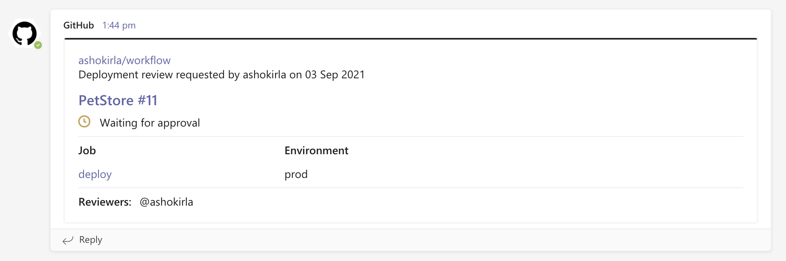
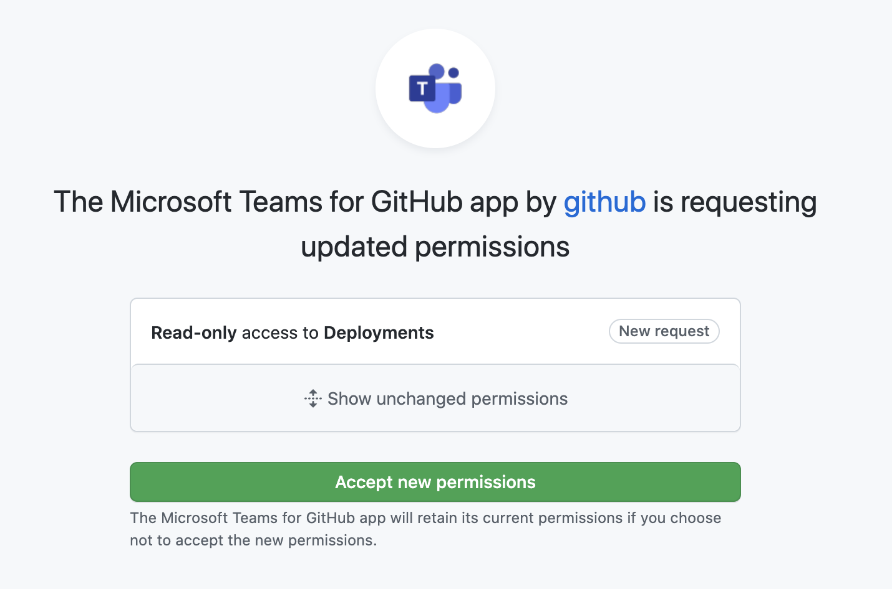
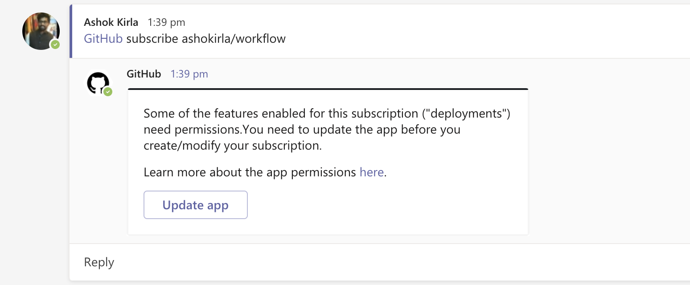
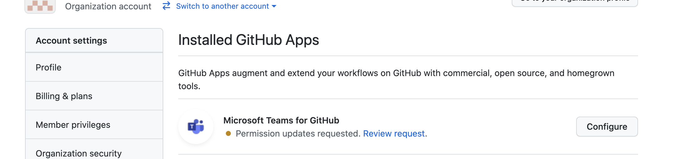

# GitHub + Microsoft Teams Integration

## Help Your Teams Communicate and Collaborate Better

GitHub is the world's leading software development platform. [Microsoft Teams](https://products.office.com/microsoft-teams/group-chat-software) is one of the most popular communication platforms where modern development teams come together to build world-class products and services. With two of your most important workspaces connected, you'll stay updated on what's happening on GitHub without leaving Microsoft Teams.

Developers spend a considerable amount of time communicating with the team, monitoring the issues, pull requests and deployment statuses. This necessitates constant switching of context between GitHub and Microsoft Teams (collaborate). The GitHub integration for Microsoft Teams gives you and your teams full visibility into your GitHub projects right in your Teams channels, where you generate ideas, triage issues and collaborate with other teams to move projects forward.

GitHub integration for Microsoft Teams is now GA and is built and maintained by GitHub.

## Table of Contents
- [Installing the GitHub integration for Teams](#installing-the-github-integration-for-teams)
  - [Requirements](#requirements)
  - [Installation](#installation)
 - [Get Started](#get-started)
   - [Subscribe notifications](#subscribe-notifications)
   - [Customize notifications](#customize-notifications)
   - [Filters](#filters)
   - [PR and Issue notification cards and Threading](#pr-and-issue-notification-cards-and-threading)
   - [Deployments and actions approval notifications](#deployments-and-actions-approval-notifications)
   - [Mentions](#mentions)
   - [Move conversations into next steps](#move-conversations-into-next-steps)
   - [Unfurling GitHub links](#unfurling-github-links)
   - [Personal app experience](#personal-app-experience)
   - [Schedule Reminders](#schedule-reminders)
   - [Command Reference](#command-reference)
   - [Authorization](#authorization)
- [Future work](#future-work)
- [Feedback](#feedback)
--------
## Installing the GitHub integration for Teams
### Requirements
This app officially supports GitHub.com (which includes our GitHub Enterprise cloud-hosted offering) and Teams.microsoft.com.

### Installation
You can go to Microsoft teams app store and install GitHub app or you can directly install from [here](https://teams.microsoft.com/l/app/ca9e26b7-dce5-44a0-b2b7-a70a3d65ce25).

Upon installing, a welcome message is displayed as shown in the following image. Use the ``@GitHub`` handle to start interacting with the app.

## Get Started
At this point, your Teams and GitHub user accounts are not linked. To link the two accounts, authenticate to GitHub using a @github signin command.

### Subscribe notifications
You can subscribe to get notifications for pull requests and issues for an Organization or Repository's activity using `@github subscribe <organization>/<repository>` command.

Before you subscribe, a Microsoft Teams app needs to be installed in GitHub and you need to grant access to the repositories you would like to subscribe.

If you originally gave the app access to "All repositories" and you've created a new private repository on GitHub after installing the GitHub integration for Teams, the `@github subscribe` command will work automatically on your new repository. If you installed the app on a subset of repositories, the app will prompt you to install it on the new repository.

You need to be an organization / account owner to install the app. If you dont have access, you can request your account owner to configure the Microsoft Teams app to grant access to the repositories you need work on. You can find this app in your organization settings -> applications -> installed apps. This is a one time activity and after that you can subscribe to repository / organization in the channel of your choice.

The `@github` command also supports `unsubscribe`. To unsubscribe to notifications from a repository, use `@github unsubscribe <organization>/<repository>`

### Customize notifications
You can customize your notifications by subscribing to activity that is relevant to your Teams channel, and unsubscribing from activity that is less helpful to your project.

You can configure them using following commands:
`@github subscribe owner/repo [feature]`
`@github unsubscribe owner/repo [feature]`

Below features are enabled by default, and can be disabled with the `@github unsubscribe owner/repo [feature]` command:
- issues - Opened / closed / ReOpened
- pulls - New / merged / Close / ReOpen
- commits - New commits on the default branch (usually main)
- comments - New comments on issues and pull requests
- deployments - Deployment statuses and Actions deployment review notifications
- releases - New release and pre-release published

These are disabled by default, and can be enabled with the '@github subscribe owner/repo [feature]' command:
- reviews - Pull request reviews
- branches - branch creation and deletion
- discussions - Discussions created or answered
- +label:"your label" - Filter issues, pull-requests and comments based on their labels.

We also support repository notifications. You will get notified when your repo is made public or deleted. This notification is enabled by default and there is no separate feature to turn in off. Since repository update is a destructive activity, we want to notify the customer always.

To see the list of subscribed features, use `@github subscribe list features`

### Filters
#### Branch filters for commits
Branch filters allow filtering commit notifications. By default when you subscribe for commits feature, you will get notifications for your default branch (i.e. main). However, you can choose to filter on a specific branch, or a pattern of branches or all branches.

- `@github subscribe org/repo commits`  for commit notifications from a default branch.
- `@github subscribe org/repo commits:*`  for commit notifications across all the branches.
- `@github subscribe org/repo commits:myBranch`  for commit notifications from a specific branch.
- `@github subscribe org/repo commits:users/*`  for commit notifications from a pattern of branches.

You can unsubscribe from the commits feature using `@github unsubscribe org/repo commits.

#### Label filters for issues and prs
Label filters allow filtering incoming events based on a whitelisted label. You can add a label filter with the subscribe command
`@github subscribe owner/repo +label:priority:HIGH`

This creates a required-label filter with the value priority:HIGH. Incoming events that support filters are discarded unless they have that label. To update the existing filter just enter a new one, the old one will be updated. Currently, we only support having one filter. Multiple filters might be supported in the future.

The notifications that are filtered by label are:
- issues
- pull requests
- reviews
- comments (for both issues and pull requests)

You can remove a filter by with unsubscribe command
'@github unsubscribe owner/repo +label:priority:HIGH'

It is common to have certain special characters in labels. Therefore we added support for the most common special characters for label filters. Here are a few examples:
- label:priority:HIGH
- label:teams/designers
- label:"DO NOT MERGE"
- label:"very important"
- label:":construction: WIP"

### PR and Issue notification cards and Threading
Notifications for any PR and Issue are grouped under a parent card as replies. The parent card always shows the latest status of the PR/Issue along with other meta-data like title, description, assignees, reviewers, labels and checks. Threading gives context and helps improve collaboration in the channel.

Any new event that happens on a pull request or issue (like comment/review/close/merge) is added as a reply to the parent card.

Note: In case of Draft PRs, updates are not notified in the channel. Once the Draft PR is moved to ready, the channel will start getting the notifications

### Deployments and actions approval notifications
Deployment review notifications for your GitHub Actions environments can now be tracked end-to-end from your channel or personal app in Teams.
You will be notified when a review is pending on your environment, when an approval is completed and you can see the real time status of your deployments.

These notifications are available as part for "deployments" feature which is enabled by default when you subscribe to your repository or organization.

The following are the notifications available as part of "deployments" feature:
1. Deployment review pending notifications for your environments being deployed through GitHub Actions workflow.

2. Deployment review completed notifications for your environments being deployed through GitHub Actions workflow.

3. Deployment status notifications for your environments. And the notification shows workflow information if the environment is deployed from GitHub Action workflow.

#### Updates to the app permissions for deployment notifications
To receive the above notifications you need to grant access for Microsoft Teams in your GitHub organization.

"deployments" is a default enabled feature similar to "issues", "pulls", "commits". However, you will not get deployment notifications unless you grant permissions in your organization.

**Existing subscriptions:**
- Your existing subscriptions will continue to work. However you will not recieve deployment notification until you grant permissions.

- You cannot modify your existing subscriptions until you update the app and grant permissions. We will notify you to update when you try to modify an existing subscription.

- However, if you choose not to update the app, you can unsubscribe "deployments" feature for the existing subscriptions and then you will be able to modify your subscriptions.

**New subscriptions:**
- You cannot add a new subscription until you grant permissions in your GitHub organization as "deployments" is a default feature in your subscription. We will notify you to update when you try to add a new subscription.

You can directly update the app by going to your GiHub organization->settings->installed apps and update Microsoft Teams app for GitHub.

### Mentions
When you subscribe to a repository in Teams, you will now see yourself mentioned in the notifications where you are referred and needs your attention.

When you receive notifications for Issues, PRs and Deployments, here are the cases when you will be mentioned.
- Assignee in an Issue
- Reviewer for a PR
- Mentioned in a PR/Issue description/comment/discussion
- Reviewer for a Deployment
- Scheduled reminders for PR review requests

#### How does mentions work?
Mentions will work only if you login to GitHub app from Microsoft Teams. When you login to GitHub app with your GitHub id, we map it with your Microsoft Teams id and ping you in Teams whenever you are mentioned in any of the GitHub notifications.  

**Note**: If you have multiple Microsoft Teams tenants where you use GitHub app, mentions will work only in the tenant where you login to GitHub app the latest. 

### Move conversations into next steps
Teams conversations often lead to decisions and actionable takeaways. You can perform following actions on GitHub directly from Microsoft Teams:
- Create issue
- Close and ReOpen issue
- Comment on issue and pull request

Users need to be signed into GitHub to perform these actions from Teams. In case the user did not sign in and tried to perform this action, the user gets a notification to sign in before performing the action.

### Unfurling GitHub links
When you share links to GitHub activities and properties in the channel, more details are automatically extracted and shown as preview in Microsoft Teams channel. We support link previews for:
- pull requests
- issues
- discussions
- comments
- code snippets
- repositories
- accounts or organizations

Previews of links will not be shown if the repository is private and the user that shared the link:
- Not signed in to their GitHub account
- The repository is not authorized i.e the Microsoft Teams app is not installed in the GitHub repo.

#### Unfurling discussions

Discussions and discussion comments can be automatically unfurled in Teams.

Unfurling links to discussions requires the `Discussions (read)` permission to be granted to the installed GitHub Teams app in your organization or repository.

If you have previously installed the GitHub Teams app and you aren't able to unfurl discussion links, you may need to update your app to have the latest permissions.

You can update your installation's permissions by following these steps:
1. Go to your organization settings tab.
2. Click "GitHub Apps" on the sidebar.
3. You should see an entry for "Microsoft Teams for GitHub", with a message saying that a permissions update has been requested. Click the "Review request" link.
4. Review the list of updated permissions, which should include "Read access to Discussions".
5. Click the "Accept new permissions" button.

🎉 Now that you've updated the permissions, you can unfrul discussion links!

Note: We're working on making this process easier in the future with a prompt from the Teams integration itself – stay tuned!

### Personal app experience
As part of personal app experience, you can now subscribe to your repositories and receive notifications for:
- issues
- pull requests
- discussions
- commits

All the commands available in your channel are now available for Personal chat for GitHub.

You can also signin to GitHub with Personal app chat and avoid separate signin in your channels.

### Schedule Reminders
You can now schedule reminders for pending pull requests. With this feature you can now get periodic reminders of pending pull requests as part of your channel or personal chat.

#### Channel reminders
From Teams' channel, user can run following command to configure a reminder for pending pull requests on your Organization or Repository.
`@github schedule organization/repository`

This will create reminder for weekdays at 9.30 AM. However, if you want to configure reminder for a different day or time, you can achieve that by passing day and time as explained below.
`@github schedule organization/repository <Day format> <Timeformat>`

|Command	| Functionality |
| -------------------- |----------------|
|`@github schedule <organization>`| Creates a default reminder on the organization for weekdays at 9.30 AM |
|`@github schedule <organization>/<Repository>`| Creates a default reminder on the repository for weekdays at 9.30 AM |
|`@github schedule <organization>/<Repository> everyday 14:30`| Creates reminder on the repository for everyday at 2:30 PM |
|`@github schedule <organization>/<Repository> Mon,Tue 14:30`| Creates reminder on the repository for Monday and Tuesday at 2:30 PM |
|`@github schedule <organization> Mon-Wed,Fri 9,14:30`| Creates reminder on the organization for Monday, Tuesday, Wednesday and Friday at 9:00 AM and 2:30 PM |

- In a channel only organization admin can configure reminders.
- The day formats supported are weekdays, weekends, everyday and individual days or the sequence can be given with Mon ,Tue ,Wed,Thu,Fri,Sat,Sun.
- The time format is 24 scale and we only support 30 minute intervals. The timezone is automatically taken from the Microsoft Teams timzone.

You can remove reminders from a channel by running the following command
`@github unschedule organization/repository`

You can get the list of reminders configured in a channel by running
`@github schedule list`

#### Personal reminders
You can configure similar reminders in your personal chat too.

- In personal chat, reminders can be configured only at the organization level. Repository level filter is not supported.
- You need to be a member of the organization to configure reminders in the personal chat.

### Command reference

The following table lists all the commands you can use in your Microsoft Teams channel.

|Command	| Functionality |
| -------------------- |----------------|
| @github signin	| Connect to your GitHub Account |
| @github subscribe <organization>/<Repository>	| Subscribe to and Organization or Repository |
| @github subscribe <organization>/<Repository>	[feature] | Subscribe to specific feature in an Organization or Repository |
| @github subscribe list	| List the subscriptions in the channel |
| @github subscribe list	features | List the subscriptions in the channel and the features subscribed |
| @github unsubscribe <Organization>/<Repository>	| Unsubscribe from Organization or Repository |
| @github unsubscribe <Organization>/<Repository>	[feature] | Unsubscribe a specific feature in an Organization or Repository |
| @github signout	| Disconnect with your GitHub Account and remove all subscriptions |

### Authorization
By granting the app access, you are providing the following authorizations to your GitHub and Microsoft Teams accounts:

#### Teams permission scopes

|Permission scope|Why we need it|
|---|---|
|Access private conversations between you and the App | To message you with instructions.  |
|Add link previews to GitHub.com to messages| To render rich links to `github.com`|
|Add github commands| To add the `@github` command to your Team channels |
|View the organization's name, email domain, and icon| To store subscriptions you set up|
|Post messages as the app| To notify you of activity that happens on GitHub|

#### GitHub permission scopes

|Permission scope|Why we need it|
|---|---|
|Read access to issues, metadata, pull requests, discussions, and repository projects | To render previews of links shared in Teams|

## Upcoming features and roadmap
We're constantly at work to improve the app, and soon you’ll see new features stated below. To request additional capabilities please [request a feature](https://github.com/integrations/microsoft-teams/issues/new/choose).

* @ mentions support - notify the user when they are assigned an issue, added as a reviewer for PR or Deployment, someone mentioned you in a comment or description which is posted to the channel/personal chat via subscription.

* Schedule reminders updates - Provide advanced controls for schedule reminders backed by a easy to use UI and remove administrator requirement for scheduling a reminder.

Some ideas under consideration:
* Support for GHES
* Personal activity notifications - Track all your work personally with the GitHub personal bot

## Feedback

Please [create an issue](https://github.com/integrations/microsoft-teams/issues/new) to request a feature or report a problem.
