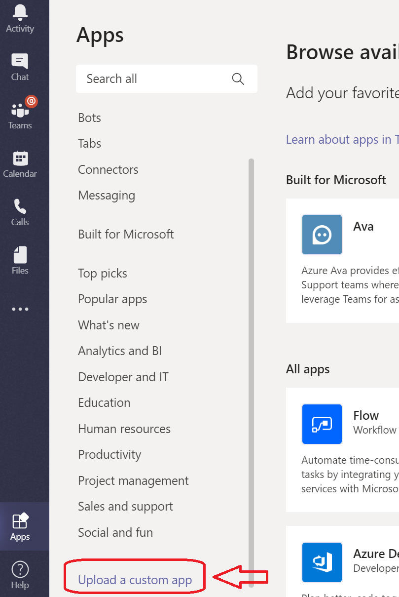
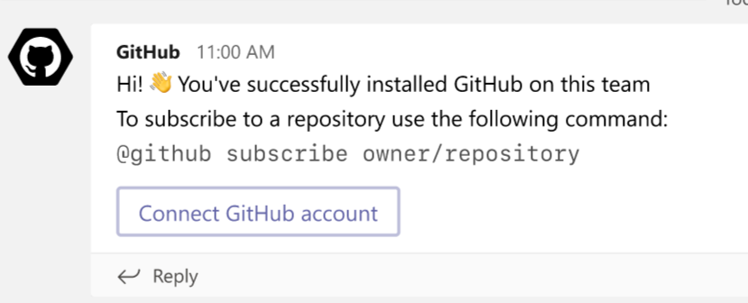
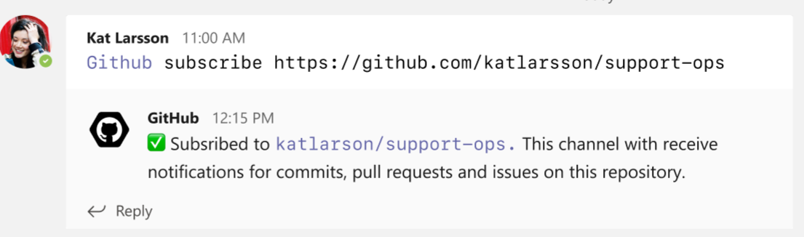
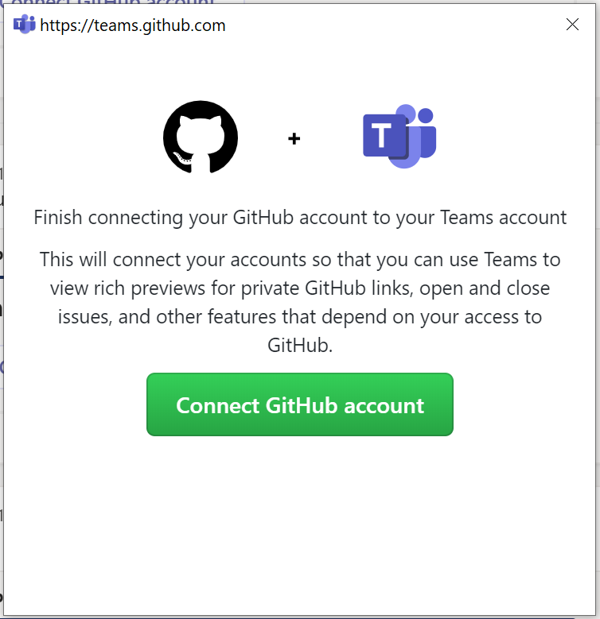
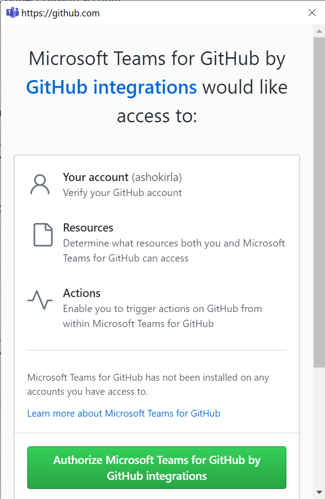
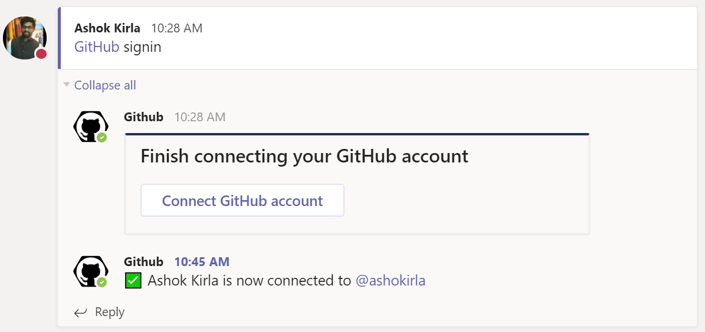
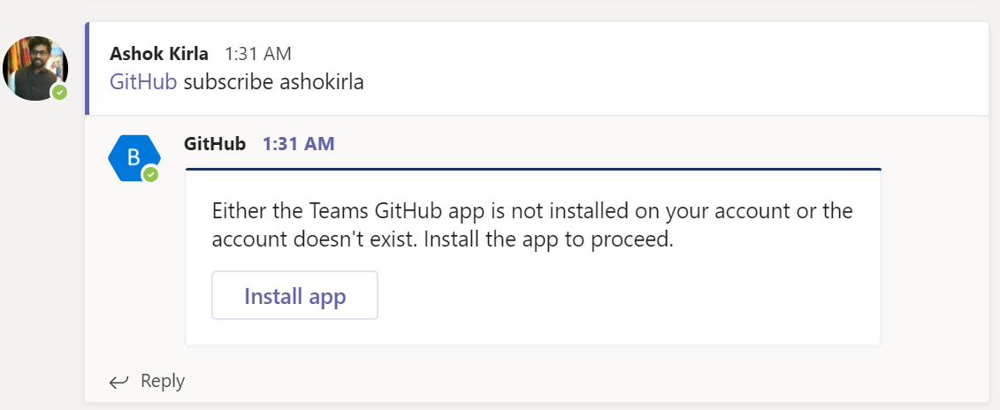
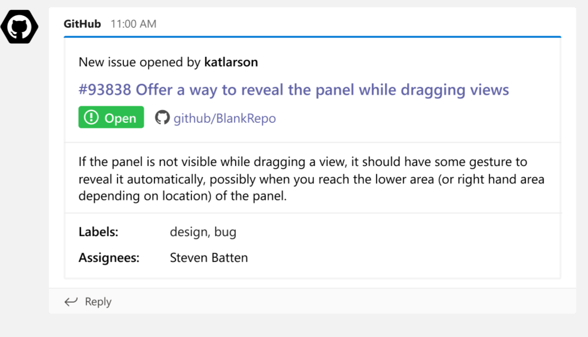
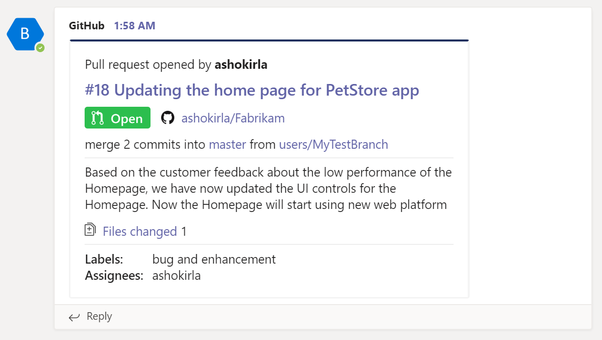
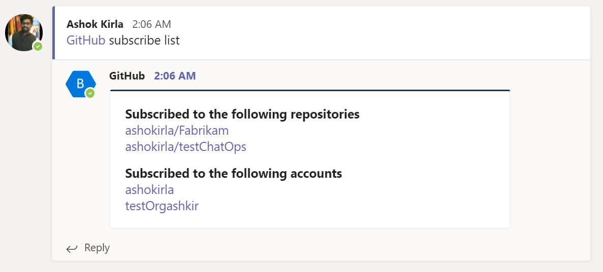

# GitHub + Microsoft Teams Integration

> **Heads Up!** The GitHub and Microsoft Teams app is in Alpha (private preview) 

## About

GitHub is worlds leading software developement platform. [Microsoft Teams](https://products.office.com/microsoft-teams/group-chat-software) is one of the best communication platforms where modern developers come together, collaborate trying to build world class products and services.

Today, developers spend considerable amount of time communicating with the team, monitoring the issues, pull requests and deployment statuses. This necessitates constant switching of context between GitHub and Microsoft Teams (collaborate). ChatOps is a team and collaboration centric way of working where in people, conversations, tools, and files are ensembled in one place i.e. workplace messaging apps.

The GitHub integration for Microsoft Teams gives you and your teams full visibility into your GitHub projects right in Teams channels, where you generate ideas, triage issues and collaborate with other teams to move projects forward. This integration is built and maintained by GitHub.

## Table of Contents
- [Installing the GitHub integration for Teams](#installing-the-github-integration-for-teams)
  - [Requirements](#requirements)
  - [Installation](#installation)
  - [Subscribing and Unsubscribing](#subscribe)
  - [Authorization](#authorization)
  - [Configuration](#configuration)
- [Need help?](#questions-need-help)
- [License](#license)
--------
## Installing the GitHub integration for Teams
### Requirements
This app officially supports GitHub.com and Teams.microsoft.com.

### Installation
Download the [manifest]() and upload it as a custom app and install it in the team of your choice. 

 

Upon installing, a welcome message is displayed as shown in the following image. Use the ``@GitHub`` handle to start interacting with the app.

 
 
### Connect to your GitHub account
 
At this point, your Teams and GitHub user accounts are not linked. To link the two accounts, authenticate to GitHub using a `@github signin` command.

### Subscribing and Unsubscribing
You can subscribe to an Organization or Repository's activity using `@github subscribe <organization>/<repository>`. 

Before you subscribe, a Microsoft Teams app needs to be installed in GitHub. 

If you originally gave the app access to "All repositories" and you've created a new private repository on GitHub after installing the GitHub integration for Teams, the `@github subscribe` command will work automatically on your new repository. If you installed the app on a subset of repositories, the app will prompt you to install it on the new repository.

After the app is installed, and once you've subscribed to your Organization or Repository, you will start receiving notificiations for the following activities as rich text in your channels.

- `issues` - Opened, closed and reopened issues
- `pulls` - New or merged pull requests

In the future releases we will add support for commits, PR Checks, releases and also provide ability to customize the notifications at feature level for each repository.

The `@github` command also supports `unsubscribe`. To unsubscribe to notifications from a repository, use `@github unsubscribe <organization>/<repository>`

You can view all the subscriptions available on the channel using `@github subscribe list`

## Command reference

The following table lists all the commands you can use in your Microsoft Teams channel.

|Command	| Functionality |
| -------------------- |----------------|
| @azure actionGroups	| View,  link or unlink action groups for a channel |
| @azure signin	| Sign in to your Azure account |
| @azure signout	| Sign out from your Azure account |
| @azure feedback	| Report a problem or suggest a feature |

### Authorization
By granting the app access, you are providing the following authorizations to your GitHub and Microsoft Teams accounts:

#### Teams Permission Scopes

|Permission scope|Why we need it|
|---|---|
|Access private conversations between you and the App | To message you with instructions.  |
|Add link previews to GitHub.com to messages| To render rich links to `github.com`|
|Add github commands| To add the `@github` command to your Team channels |
|View the organization's name, email domain, and icon| To store subscriptions you set up|
|Post messages as the app| To notify you of activity that happens on GitHub|

#### GitHub Permission Scopes

|Permission scope|Why we need it|
|---|---|
|Read access to issues, metadata, pull requests, and repository projects | To render previews of links shared in Teams|

## Questions? Need help?
Please fill out GitHub's [Support form]('') and your request will be routed to the right team at GitHub.

## License
When using the GitHub logos, be sure to follow the [GitHub logo guidelines](https://github.com/logos).
