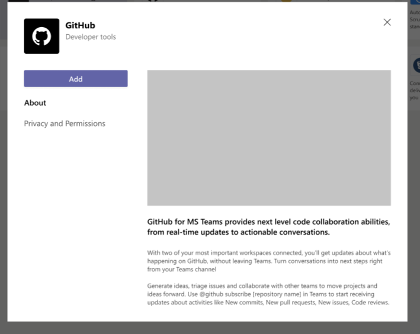
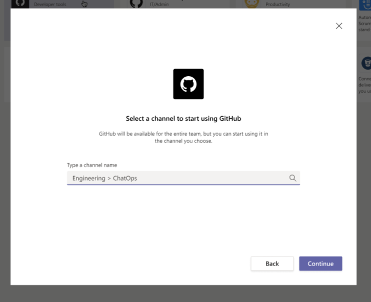

# GitHub + Microsoft Teams Integration

> **Heads Up!** The GitHub and Microsoft Teams app is in Alpha (private preview) 

## About

The GitHub integration for Microsoft Teams gives you and your teams full visibility into your GitHub projects right in Teams channels, where you generate ideas, triage issues and collaborate with other teams to move projects forward. This integration isbuilt and maintained by GitHub.

## Table of Contents
- [Installing the GitHub integration for Teams](#installing-the-github-integration-for-teams)
  - [Requirements](#requirements)
  - [Installation](#installation)
  - [Subscribing and Unsubscribing](#subscribe)
  - [Authorization](#authorization)
  - [Configuration](#configuration)
- [Need help?](#questions-need-help)
- [License](#license)
--------
## Installing the GitHub integration for Teams
### Requirements
This app officially supports GitHub.com and Teams.microsoft.com.

### Installation
[Install the GitHub integration for Microsoft Teams](''). After you choose the GitHub for Microsoft Teams app through Teams appstore, you will be taken through the installation flow.

After the app is installed, and once you've added the GitHub integration to the relevant channels, you will see previews of links to GitHub issues, pull-requests as rich text in your channels.

### Subscribing and Unsubscribing

At this point, your Teams and GitHub user accounts are not linked. To link the two accounts, authenticate to GitHub using a `@github signin` command.

The `@github` command also accepts a `subscribe` argument that you can use to subscribe to an Organization or Repository's activity `@github subscribe <organization>/<repository>`.

If you originally gave the app access to "All repositories" and you've created a new private repository on GitHub after installing the GitHub integration for Teams, the `@github subscribe` command will work automatically on your new repository. If you installed the app on a subset of repositories, the app will prompt you to install it on the new repository.

The `@github` command also supports `unsubscribe`. To unsubscribe to notifications from a repository, use `@github unsubscribe <organization>/<repository>`

### Authorization
By granting the app access, you are providing the following authorizations to your GitHub and Microsoft Teams accounts:

#### Teams Permission Scopes

|Permission scope|Why we need it|
|---|---|
|Access private conversations between you and the App | To message you with instructions.  |
|Add link previews to GitHub.com to messages| To render rich links to `github.com`|
|Add github commands| To add the `@github` command to your Team channels |
|View the organization's name, email domain, and icon| To store subscriptions you set up|
|Post messages as the app| To notify you of activity that happens on GitHub|

#### GitHub Permission Scopes

|Permission scope|Why we need it|
|---|---|
|Read access to issues, metadata, pull requests, and repository projects | To render previews of links shared in Teams|

### Configuration

As you subscribe to the organization/repository in GitHub, you will start receiving notificiations for the following activities by default.

- `issues` - Opened, closed and reopened issues
- `pulls` - New or merged pull requests
- `statuses` - Statuses on pull requests

You can disable the notifications with `@github unsubscribe organization/repo`. In the future releases we add support for commits, deployments, release and also provide ability to customize the notifications at feature level for each organization/repository.

You can view all the subscriptions available on the channel using `@github subscribe list`

## Questions? Need help?
Please fill out GitHub's [Support form]('') and your request will be routed to the right team at GitHub.

## License
When using the GitHub logos, be sure to follow the [GitHub logo guidelines](https://github.com/logos).
