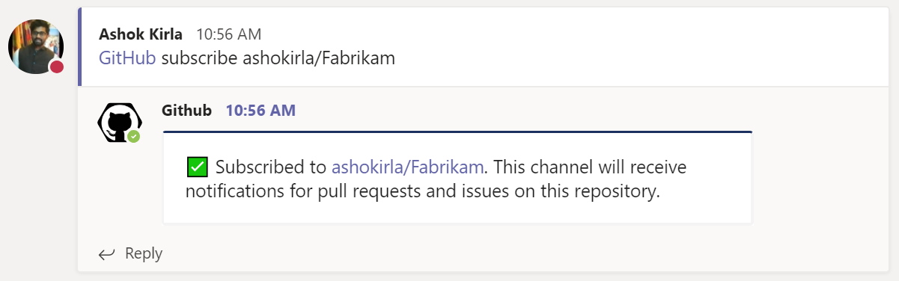
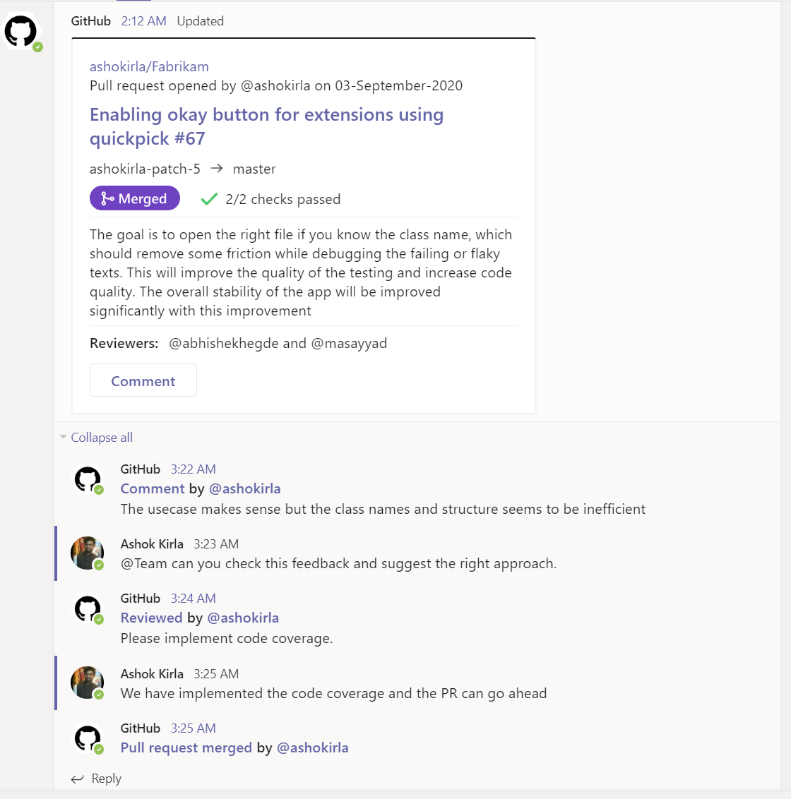
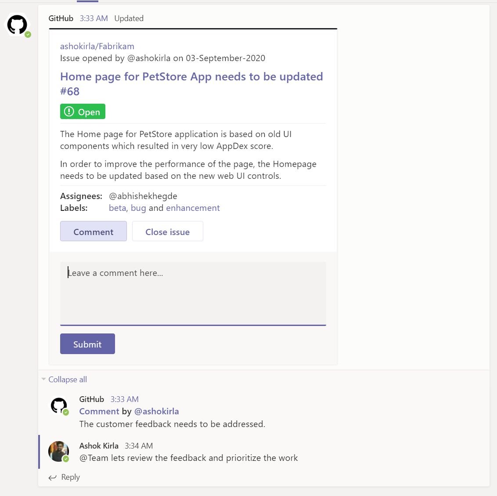
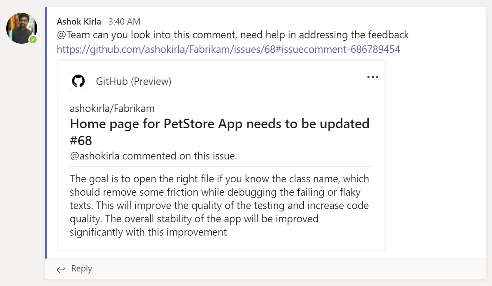

The GitHub integration for Microsoft Teams gives you and your teams full visibility into your GitHub projects right in Teams channels, where you generate ideas, triage issues and collaborate with other teams to move projects forward. This integration is built and maintained by GitHub.

You can subscribe to get notifications for pull requests and issues for an Organization or Repository's activity using `@github subscribe <organization>/<repository>` command. 

You can unsubscribe to notifications from a repository, use `@github unsubscribe <organization>/<repository>`
You can customize your notifications by subscribing to specific features. You can configure them using following commands:
`@github subscribe owner/repo [feature]`
`@github unsubscribe owner/repo [feature]`

Notifications for any PR and Issue are grouped under a parent card as replies. The parent card always shows the latest status of the PR/Issue along with other meta-data like title, description, assignees, reviewers, labels and checks. Threading gives context and helps improve collaboration in the channel. Any new event that happens on a pull request or issue (like comment/review/close/merge) is added as a reply to the parent card. 

Teams conversations often lead to decisions and actionable takeaways. You can perform following actions on GitHub directly from Microsoft Teams:
- Create issue
- Close and ReOpen issue
- Comment on issue and pull request

When you share links to GitHub activities and properties in the channel, more details are automatically extracted and shown as preview in Microsoft Teams channel. We support link previews for:
- pull requests
- issues
- comments
- code snippets
- repositories
- accounts or organizations

### Command reference

The following table lists all the commands you can use in your Microsoft Teams channel.

|Command	| Functionality |
| -------------------- |----------------|
| @github signin	| Connect to your GitHub Account |
| @github subscribe <organization>/<Repository>	| Subscribe to and Organization or Repository |
| @github subscribe <organization>/<Repository>	[feature] | Subscribe to specific feature in an Organization or Repository |
| @github subscribe list	| List the subscriptions in the channel |
| @github subscribe list	features | List the subscriptions in the channel and the features subscribed |
| @github unsubscribe <Organization>/<Repository>	| Unsubscribe from Organization or Repository |
| @github unsubscribe <Organization>/<Repository>	[feature] | Unsubscribe a specific feature in an Organization or Repository |
| @github signout	| Disconnect with your GitHub Account and remove all subscriptions |
